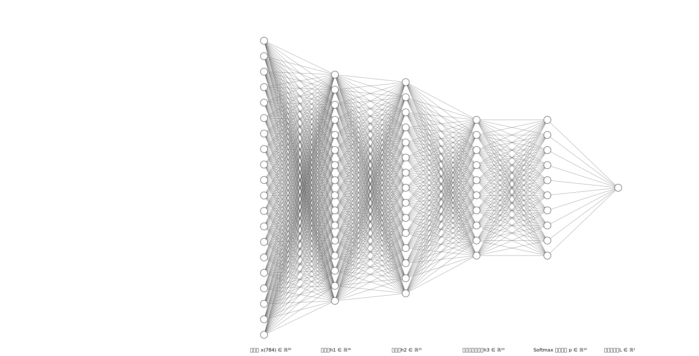

# 手写数字识别(MNIST) 全公式推导 · 纯手动反向传播

[English](./README_en.md) | [简体中文](./README.md)

> 面向机器学习入门：从网络结构、前向传播、交叉熵损失，到矩阵求导、链式法则、完整反向传播手推。
> 不依赖框架黑盒，一步步拆解单层/多层神经网络数学原理，附维度校验 + Python 可运行伪代码。

> 🚀 想要直接运行代码？ 本文对应的纯 NumPy 完整实现（包含单样本基础版与 Batch 批量实战版）已在 [../code](../code) 目录下就绪。请前往查看 [mnist_numpy.py](../code/mnist_numpy.py) 等可执行文件！

适用人群：
- 后端/全栈开发者，想补神经网络底层数学
- 正在学习算法、深度学习、凸优化入门的同学
- 面试准备神经网络推导、梯度相关算法题

## 视频资源
资源待更新。

## 阅读指南

如果您是初学者，建议先看“前置基础”确认基础，然后对照“符号速查表”理解每一个公式的维度。推导部分重点掌握“通用法则”，再逐层代入。代码实现可以参考最后的伪代码。

## 前置基础：
- 简单的神经网络构造
- 矩阵乘法运算
- 微积分的（偏）导数
- 多元微积分链式法则（向量对向量）
- 梯度下降算法

### 💡 核心符号速查表 (Notation Cheat Sheet)
*在深入矩阵求导之前，请将此表作为“导航图”。推导中随时回来查阅维度。*

| 符号 | 含义 | 维度示例 |
| :--- | :--- | :--- |
| $x$ | 输入图像展平列向量 | $784 \times 1$ |
| $h_i$ | 第 $i$ 层的线性输出（未激活） | 取决于层 |
| $a_i$ | 第 $i$ 层的激活输出 | 同上 |
| $W_i$ | 第 $i$ 层的权重矩阵 | 例如 $16 \times 784$ |
| $b_i$ | 第 $i$ 层的偏置向量 | $16 \times 1$ |
| $J_i$ | 第 $i$ 层的雅可比矩阵（输出对输入的偏导矩阵） | 视当前层变换而定 |
| $g_v$ (如 $g_h, g_i$) | $\frac{\partial L}{\partial v}$ ，损失对某节点变量 $v$ 的梯度（用于误差传递） | 与对应节点相同 |
| $g_W, g_b, g_X$ | $\frac{\partial L}{\partial W}$ 等，损失对权重、偏置、输入的梯度 | 与对应变量相同 |
| $p$ | Softmax 输出的概率向量 | $10 \times 1$ |
| $y$ | One-Hot 真实标签 | $10 \times 1$ |
| $L$ | 交叉熵损失 | 标量 |
| $\alpha$ | 学习率 | 标量 |
| $\odot$ |	逐元素相乘（哈达玛积 Hadamard Product）	| 同维度向量 / 矩阵 |

## 1. 网络架构与前向传播 (Forward Propagation)



假设输入图像展平后为列向量 $x$ ，网络包含两个隐藏层和一个输出层。

- **输入层 (Input Layer)**
  - 输入变量： $x$ 
  - 向量维度： $(784 \times 1)$ 
- **隐藏层 1 (Hidden Layer 1)**
  - 线性计算： $h_1 = W_0 x + b_0$ 
  - 激活函数： $a_1 = \text{ReLU}(h_1)$ 
  - 参数维度： $W_0$ 为 $(16 \times 784)$ ， $b_0$ 为 $(16 \times 1)$ ， $a_1$ 为 $(16 \times 1)$ 
- **隐藏层 2 (Hidden Layer 2)**
  - 线性计算： $h_2 = W_1 a_1 + b_1$ 
  - 激活函数： $a_2 = \text{ReLU}(h_2)$ 
  - 参数维度： $W_1$ 为 $(15 \times 16)$ ， $b_1$ 为 $(15 \times 1)$ ， $a_2$ 为 $(15 \times 1)$ 
- **输出层 (Output Layer)**
  - 线性计算： $h_3 = W_2 a_2 + b_2$ 
  - 激活函数： $p = \text{Softmax}(h_3)$ 
  - 概率公式： $p_i = \frac{e^{h_{3,i}}}{\sum_{k=1}^{10} e^{h_{3,k}}}$ 
  - 参数维度： $W_2$ 为 $(10 \times 15)$ ， $b_2$ 为 $(10 \times 1)$ ， $p$ 为 $(10 \times 1)$ 

注：隐藏层使用的 ReLU 激活函数数学定义为 $\text{ReLU}(h) = \max(0, h)$ 。该操作会独立作用于向量中的每一个元素（即若元素小于 0 则置为 0，大于 0 则保持不变）。需要注意的是，ReLU 在 $h=0$ 处数学上是不可导的，工程实现中通常采用次梯度（Subgradient）的思想，将其在 $h=0$ 处的导数人为赋值为 0 或 1（本篇代码实现中赋值为 0）。

*为了简化推导，隐藏层使用了较小的神经元数量（16和15），实际应用中可放大到 128 或 256。*

## 2. 损失函数 (Loss Function)
处理多分类问题，采用交叉熵损失函数（Cross-Entropy Loss）。

$$
L = -\sum_{k=1}^{10} y_k \ln(p_k)
$$

注： $y$ 为真实标签的 One-Hot 列向量，维度 $(10 \times 1)$ 。若正确类别为 $c$ ，则 $y_c = 1$ ，其余 $y_{i \neq c} = 0$ 。

## 3. 反向传播推导 (Backward Propagation)
反向传播的核心逻辑分为两步：首先计算误差在节点间的传递（节点梯度 $g$ ），然后利用节点梯度计算该层权重以及偏置的更新量。

### 补充：神经网络反向传播的两大通用法则

在神经网络中，相邻层之间最核心的计算交替进行：**线性变换** 与 **激活函数**。我们可以将这两种操作的公式提炼成极其对称的正反向对照格式。（定义 $g$ 为损失函数 $L$ 对当前变量的梯度）

多元链式法则核心公式：

$$
\bar{g}_i = J_i^T \bar{g}_{i+1}
$$

其中 $J_i$ 代表当前层的雅可比矩阵。

### 法则 1：线性变换层的传播规律 (雅可比矩阵化简版)
假设从输入节点 $X$ 经过权重矩阵 $W$ 进行线性变换，得到输出节点 $h$ 。其正向计算公式为：

$$h = WX + b \quad [\text{正向传播 Forward Propagation}]$$

变量与典型维度说明：
- $W$ ：当前层的权重矩阵，假设维度为 $(15 \times 16)$ 。
- $X$ ：代表当前层的输入（上一层的激活输出，列向量），假设维度为 $(16 \times 1)$ 。
- $b$ ：当前层的偏置项（列向量），假设维度与 $h$ 相同，为 $(15 \times 1)$ 。
- $h$ ：当前层的线性输出节点（列向量），其维度为 $(15 \times 1)$ 。
- $g_h$ ：已知下一层传回来的、损失 $L$ 对输出 $h$ 的梯度 $\left(\frac{\partial L}{\partial h}\right)$ ，维度与 $h$ 相同，为 $(15 \times 1)$ 。

根据多元链式法则核心公式，我们可以直接得出针对 $X$ 、 $W$ 和 $b$ 的三个终极求导结论：

#### 结论 1：对输入节点 $X$ 求梯度（用于误差继续向后传递）
当对输入节点 $X$ 求导时，此时的雅可比矩阵 $J$ 即为权重 $W$ 。当前层节点的梯度，等于权重矩阵的转置乘以下一层的梯度：

$$
g_X = \frac{\partial L}{\partial X} = W^T g_h \quad [\text{反向传播 Backward Propagation}]
$$

- 维度验算： $(16 \times 15) \times (15 \times 1) = (16 \times 1)$ ，完美匹配 $X$ 的原有维度。

#### 结论 2：对权重 $W$ 求梯度（用于当前层参数更新）
当对权重 $W$ 求导时，雅可比矩阵对应的是输入节点 $X$ 。计算权重矩阵梯度的公式，是下一层梯度列向量与上一层输入行向量的外积：

$$
g_W = \frac{\partial L}{\partial W} = g_h X^T \quad [\text{反向传播 Backward Propagation}]
$$

- 维度验算： $(15 \times 1) \times (1 \times 16) = (15 \times 16)$ ，完美匹配 $W$ 的原有维度。

#### 结论 3：对偏置项 $b$ 求梯度（用于当前层参数更新）
当对偏置 $b$ 求导时，由于加法操作的偏导数为 1（雅可比矩阵为单位矩阵 $I$ ），偏置的梯度完全等于下一层传回来的梯度：

$$
g_b = \frac{\partial L}{\partial b} = g_h \quad [\text{反向传播 Backward Propagation}]
$$

- 维度验算： $g_b$ 直接继承 $g_h$ 的维度，为 $(15 \times 1)$ ，完美匹配 $b$ 的原有维度。

### 法则 2：激活函数层的传播规律
假设预激活输入节点为 $h$ ，应用激活函数 $\Phi(\cdot)$ （如 ReLU），得到输出节点 $a$ 。

$$
a = \Phi(h) \quad [\text{正向传播 Forward Propagation}]
$$

根据多元链式法则，误差穿透激活函数时的求导公式为：

$$
g_h = g_a \odot \Phi'(h) \quad [\text{反向传播 Backward Propagation}]
$$

- **符号说明**：激活函数 $\Phi(\cdot)$ 及其导数 $\Phi'(\cdot)$ 均是独立作用于向量的每个元素上。符号 $\odot$ 表示**逐元素相乘 (Element-wise Multiplication)**。

*掌握了这两个通用法则，后续隐藏层的复杂推导，就是这两个公式的交替套用组合！-- 详细推导待更新。*

### 3.1 输出层梯度 (Output Layer)
计算损失 $L$ 对输出层预激活值 $h_3$ 的导数，记为 $g_3$ 。从数学上， $g_3 = \left( \frac{\partial p}{\partial h_3} \right)^T \frac{\partial L}{\partial p}$ ，通过链式法则推导交叉熵与 Softmax 的结合，可得到极简的减法形式：

$$
g_3 = \frac{\partial L}{\partial h_3} = p - y
$$

- 维度验算： $g_3$ 为 $(10 \times 1)$ 的列向量。

*该结果是交叉熵损失 + Softmax 激活的著名简化形式，详细推导待更新。*

计算第 3 层权重和偏置的梯度：

$$
\frac{\partial L}{\partial W_2} = g_3 a_2^T
$$

$$
\frac{\partial L}{\partial b_2} = g_3
$$

- 维度验算： $\frac{\partial L}{\partial W_2} = (10 \times 1) \times (1 \times 15) = (10 \times 15)$ ，完美匹配 $W_2$ 原有维度。

### 3.2 隐藏层 2 梯度 (Hidden Layer 2)
误差从 $h_3$ 传回 $h_2$ ，需要乘上权重矩阵的转置，并穿过 ReLU 激活函数（使用逐元素相乘 $\odot$ ）：

$$
g_2 = \frac{\partial L}{\partial h_2} = \left( W_2^T g_3 \right) \odot \text{ReLU}'(h_2)
$$

- 注： $\text{ReLU}'(h_2)$ 为导数向量，当 $h_2 > 0$ 时元素为 $1$ ，否则为 $0$ 。
- 维度验算： $W_2^T$ 为 $(15 \times 10)$ ， $g_3$ 为 $(10 \times 1)$ 。两者矩阵乘法结果为 $(15 \times 1)$ 。与 ReLU 导数逐元素相乘后， $g_2$ 为 $(15 \times 1)$ 列向量。

计算第 2 层权重和偏置的梯度：

$$
\frac{\partial L}{\partial W_1} = g_2 a_1^T
$$

$$
\frac{\partial L}{\partial b_1} = g_2
$$

- 维度验算： $\frac{\partial L}{\partial W_1} = (15 \times 1) \times (1 \times 16) = (15 \times 16)$ ，完美匹配 $W_1$ 原有维度。

### 3.3 隐藏层 1 梯度 (Hidden Layer 1)
同理，误差从 $h_2$ 传回 $h_1$ ：

$$
g_1 = \frac{\partial L}{\partial h_1} = \left( W_1^T g_2 \right) \odot \text{ReLU}'(h_1)
$$

- 维度验算： $W_1^T$ 为 $(16 \times 15)$ ， $g_2$ 为 $(15 \times 1)$ ，矩阵乘法后 $g_1$ 为 $(16 \times 1)$ 列向量。

计算第 1 层权重和偏置的梯度：

$$
\frac{\partial L}{\partial W_0} = g_1 x^T
$$

$$
\frac{\partial L}{\partial b_0} = g_1
$$

- 维度验算： $\frac{\partial L}{\partial W_0} = (16 \times 1) \times (1 \times 784) = (16 \times 784)$ ，完美匹配 $W_0$ 原有维度。

## 4. 参数更新 (Parameter Update)
利用收集到的梯度，使用学习率 $\alpha$ 对所有权重和偏置进行同步更新（梯度下降）：

$$
W_2 \leftarrow W_2 - \alpha \frac{\partial L}{\partial W_2}
$$

$$
W_1 \leftarrow W_1 - \alpha \frac{\partial L}{\partial W_1}
$$

$$
W_0 \leftarrow W_0 - \alpha \frac{\partial L}{\partial W_0}
$$

$$
b_2 \leftarrow b_2 - \alpha \frac{\partial L}{\partial b_2}
$$


$$
b_1 \leftarrow b_1 - \alpha \frac{\partial L}{\partial b_1}
$$

$$
b_0 \leftarrow b_0 - \alpha \frac{\partial L}{\partial b_0}
$$

*注意：所有梯度计算完成后，再统一进行参数更新（同步更新），否则会使用已更新的权重影响后续梯度的正确性。*

### 伪代码

```python
# 说明使用 numpy 矩阵运算习惯（@ 矩阵乘、* 逐元素乘）

# 前向传播
h1 = W0 @ x + b0
a1 = relu(h1)
h2 = W1 @ a1 + b1
a2 = relu(h2)
h3 = W2 @ a2 + b2
p = softmax(h3)
L = cross_entropy(y, p)

# 反向传播
g3 = p - y
dW2 = g3 @ a2.T
db2 = g3

g2 = (W2.T @ g3) * relu_deriv(h2)
dW1 = g2 @ a1.T
db1 = g2

g1 = (W1.T @ g2) * relu_deriv(h1)
dW0 = g1 @ x.T
db0 = g1

# 参数更新
W2 -= alpha * dW2; b2 -= alpha * db2
W1 -= alpha * dW1; b1 -= alpha * db1
W0 -= alpha * dW0; b0 -= alpha * db0
```

实际运行代码，见 [**`code/mnist_numpy.py`**](../code/mnist_numpy.py)。

## 5. 补充完整推导（待更新）
### 5.1 Softmax + 交叉熵损失 合并求导完整证明
证明： $\displaystyle \frac{\partial L}{\partial h_3} = p - y$

### 5.2 ReLU 激活函数导数详解
### 5.3 批量样本(Batch)拓展推导（工程实战常用）
当前文档为 **单样本** 推导；实际训练中使用批量数据，会引入均值、维度广播，后续补充 Batch 版本公式。

## 6. 拓展学习路线
结合本推导，延伸学习方向：
1. 凸优化基础（梯度下降进阶、约束优化）
2. 各类激活函数(Sigmoid/Tanh)反向传播
3. 正则化(L1/L2)、Dropout 数学推导
4. 优化器：SGD、Adam 原理与公式