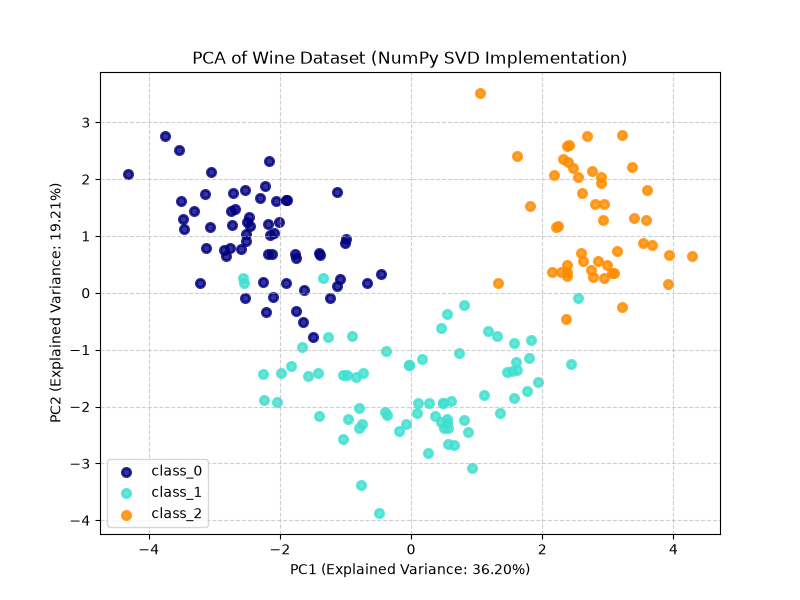

# PCA Deep Dive: From Mathematical Foundations to Industrial Implementation

本项目旨在通过数学推导与代码实践，深度拆解**主成分分析 (Principal Component Analysis, PCA)** 的底层逻辑。本项目抛弃了简单的“调包”思维，详细对比了基于纯数学矩阵运算（SVD）的手写实现与工业界标准库（Scikit-Learn）的底层差异。

## 🎯 项目初衷与核心结论

在传统的机器学习教程中，PCA 通常被描述为对**协方差矩阵进行特征值分解 (EVD)**。然而，在真实的工业界（如 Scikit-Learn 的底层 C/Cython 实现）中，直接计算高维协方差矩阵 $S = \frac{1}{n-1} B B^T$ 会导致极其严重的条件数放大与数值不稳定（精度丢失）。

本项目通过推导与代码证明了：**对去中心化后的数据矩阵进行奇异值分解 (SVD)，在数学上与协方差矩阵的特征值分解完全等价，且在工程上具备极高的数值稳定性和计算效率。**

## 📂 目录结构

```text
.
├── assets/
│   └── pca_wine.png      # 降维结果可视化图表
├── code/
│   ├── pca_numpy.py      # 基于纯 NumPy SVD 的 PCA 底层白盒实现
│   └── pca_sklearn.py    # 基于 Scikit-Learn 的工业级标准实现对比
├── docs/
│   ├── PCA.md            # PCA 推导过程
│   └── SVD.md            # PCA 与 SVD 等价性的完整数学推导过程

```

## 🧠 理论文档 (`docs/`)

文档包含了详尽的纯代数推导过程，涵盖：

1. 主成分分析 (PCA) 纯代数推导过程。完全基于矩阵的线性变换与实对称矩阵的正交对角化性质，严谨证明了：当投影矩阵 $P$ 为协方差矩阵的特征向量时，投影后的新数据空间能够实现彻底的“去相关”（无偏协方差矩阵转化为对角阵）。
2. 使用奇异值分解 (SVD) 求解 PCA 的数学推导。通过利用矩阵乘法结合律，推导出左奇异向量矩阵 $U$ 正好等于特征向量矩阵 $P$ ，并给出了最关键的方差转换公式：

$$\lambda_i = \frac{\sigma_i^2}{n-1}$$

## 💻 代码实现 (`code/`)

本项目使用了经典的高维数据集（Wine Dataset, 13维特征）进行降维基准测试。在运行前，数据均通过 `StandardScaler` 进行了严格的去中心化与量纲统一。

* **`pca_numpy.py`**: 不依赖任何高级 ML 库，纯手工使用 `np.linalg.svd` 提取左奇异向量作为主成分方向，并根据奇异值计算方差解释率。
* **`pca_sklearn.py`**: 调用 `sklearn.decomposition.PCA`。运行结果证明，手写 SVD 提取的特征值、方差解释率以及降维后的 2D 坐标映射，与 Sklearn 的底层输出**达到小数点后 8 位的绝对一致**。

## 🚀 快速开始

**1. 环境依赖**
请确保已按照 [主项目根目录](../README.md#%EF%B8%8F-本地开发环境-local-setup) 的说明，使用 `uv` 初始化好本地虚拟环境并同步了依赖。

**2. 运行对比测试**

```bash
python code/pca_numpy.py
python code/pca_sklearn.py

```

## 📈 实验结果

通过将 13 维的化学特征降维至 2 维 (PC1 & PC2)，在保留了约 55.4% 的核心方差信息的前提下，成功在 2D 平面上将三类红酒实现了清晰的聚类分离。这直观地展示了线性降维在处理高维多重共线性数据时的信息提纯能力。


